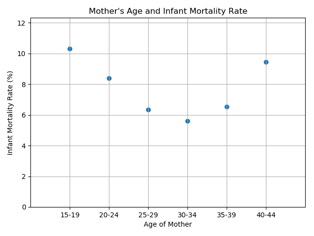

# Infant Mortality Rates

## Team Members:

Logan Caldwell, John Chambers, Jasmina Jovanovic, Hyunsoo Kim, and Ediya Yumukoff

## Project Description:

The United States has a higher Infant Mortaility Rate than any other wealthy country in the world. We set out to investigate the causes of Infant Mortality Rates (IMR) in the United States and the associated factors. 

## Research Questions to Answer:

1) Where is IMR the highest?
2) Is there a correlation between poverty and IMR?
3) Do different races experience different levels of IMR?
4) How does the education level of the mother relate to IMR?
5) Does the age of the mother play a role in IMR?
6) Does having health insurance lower the rate of IMR?
7) Does infants' birthweight affect the IMR?

## Datasets Used:

(not sure if we want to list every single dataset we pulled, or something like "we got data from the CDC")
https://wonder.cdc.gov/controller/datarequest/D69
https://www2.census.gov/programs-surveys/demo/tables/health-insurance/time-series/acs/hic05_acs.xls
http://www2.census.gov/geo/docs/maps-data/data/gazetteer/2017_Gazetteer/2017_Gaz_counties_national.zip
https://www.ers.usda.gov/data-products/county-level-data-sets/download-data/
https://nccd.cdc.gov/DHDSP_DTM/rdPage.aspx?rdReport=DHDSP_DTM.ExploreByTopic&filter=data&islDatasource=BRFSS&islTopic=T9&islFilterby=2&go=GO

## Questions - Answered

### 1) Where is IMR the highest?

*IMR is the highest in the southern and eastern United States.

### 2) Is there a correlation between poverty and IMR?

*Poverty and IMR have a postive correlation.

Average poverty by county for 2007-2016. Markers represent top 15 states for IMR:

*There is a clear correlation between IMR and poverty levels. 

*Even though the correlation holds for both whites and African Americans, African Americans experience higher levels of IMR than whites for similar poverty levels. 

### 3) Do different races experience different levels of IMR?

### 4) How does the education level of the mother relate to IMR?

### 5) Does the age of the mother play a role in IMR?

### 6) Does having health insurance lower the rate of IMR?

*There is no correlation between IMR and total rates of insurance.

*There is a positive correlation between IMR and having public insurance.

*There is also a correlation between IMR and having private insurance. 

## Conclusions

*The counties with the highest IMRs are in the southern and eastern United States.
*The factors with the strongest correlations with IMR are x, y, and z.
*In addition to the above factors, there appears to be a strong racial component in IMR which deserves further examination. 

## Suggestions for Further Study

*Examine racial differences in terms of rates of public versus private health insurance
* Examine

