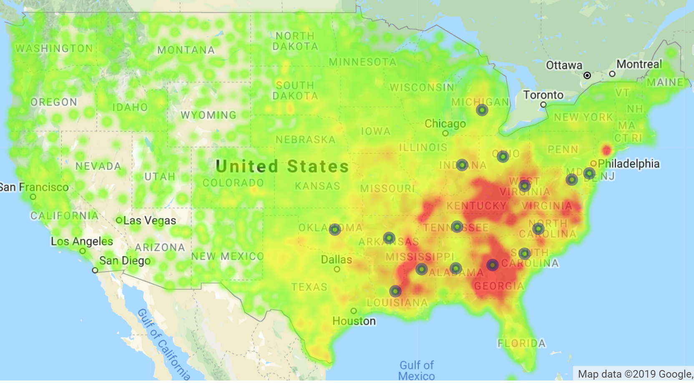
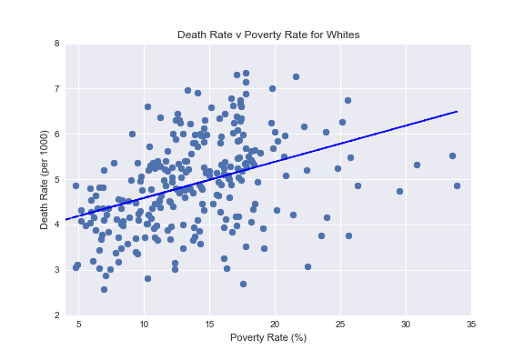

# Infant Mortality Rates

## Team Members:

Logan Caldwell, John Chambers, Jasmina Jovanovic, Hyunsoo Kim, and Ediya Yumukoff

## Project Description:

The United States has a higher Infant Mortaility Rate than any other wealthy country in the world. We set out to investigate the causes of Infant Mortality Rates (IMR) in the United States and the associated factors. 

## Research Questions to Answer:

1) What are the leading causes of infant deaths in the US?
2) Is there a correlation between poverty and IMR?
3) Do different races experience different levels of IMR?
4) How does the education level of the mother relate to IMR?
5) Does the age of the mother play a role in IMR?
6) Does having health insurance lower the rate of IMR?
7) Does infants' birthweight affect the IMR?

## Datasets Used:

https://wonder.cdc.gov/controller/datarequest/D69
https://www2.census.gov/programs-surveys/demo/tables/health-insurance/time-series/acs/hic05_acs.xls
http://www2.census.gov/geo/docs/maps-data/data/gazetteer/2017_Gazetteer/2017_Gaz_counties_national.zip
https://www.ers.usda.gov/data-products/county-level-data-sets/download-data/
https://nccd.cdc.gov/DHDSP_DTM/rdPage.aspx?rdReport=DHDSP_DTM.ExploreByTopic&filter=data&islDatasource=BRFSS&islTopic=T9&islFilterby=2&go=GO

## Questions - Answered

### 1) What are the leading casuses of infant deaths in the US?

- The leading cause of infant death is extreme immaturity, followed by Sudden Infant Death Syndrome (SIDS). Extremely premature babies are babies born before 28 weeks of gestational age. (Note that there is a correlation between the two leading causes of infant death, since SIDS rates are higher amont premature babies.)
- Most infant deaths occur either in the first 24 hours after birth as a result of extreme immaturity, or between one month and one year, as a result of SIDS 

### 2) Is there a correlation between poverty and IMR?

* Poverty and IMR have a postive correlation.

Average poverty by county for 2007-2016. Markers represent 15 highest IMR states:

* There is a clear correlation between IMR and poverty levels. 

* Even though the correlation holds for both Whites and African Americans, African Americans experience higher levels of IMR than Whites for similar poverty levels. 

### 3) Do different races experience different levels of IMR?

- There is a strong correlation between race and IMR
- African Americans have the highest IMR of all races, followed by American Indian/Alasks Native and then by Asians and Whites
- The IMR among African American babies is more than twice as high as that of White infants
- We performed a ANOVA test and a pairwise tukeyhsd test, which confirmed that the differences in rate of IMR across races is statistically significant 

- African American babies have double the rate of every leading cause of death compared to White babies
- It is possible that there are inaccuracies in the cause of death for the American Indian / Alaska Native race

### 4) How does the education level of the mother relate to IMR?

### 5) Does the age of the mother play a role in IMR?

### 6) Does having health insurance lower the rate of IMR?

* There is no correlation between IMR and total rates of insurance.

* There is a positive correlation between IMR and having public insurance or private insurance

### 7) Does infants' birthweight affect the IMR?

## Conclusions

*The counties with the highest IMRs are in the southern and eastern United States.
*The factors with the strongest correlations with IMR are x, y, and z.
*In addition to the above factors, there appears to be a strong racial component in IMR which deserves further examination. 

## Suggestions for Further Study

* Examine racial differences in terms of rates of public versus private health insurance
* Examine correlation between vitamin D defficiency and premature labor between different races

